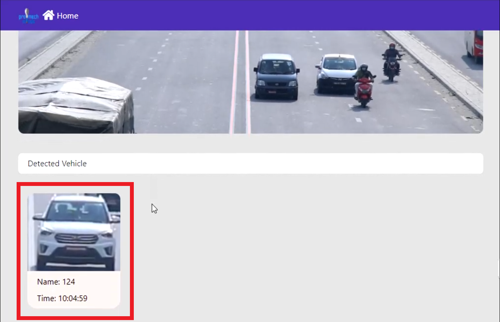

# Introduction

According to the WHO, each year approximately 1.23 million people lost their lives as a result of road traffic crashes. One of the main reasons for this is the lane violation. So, lane violation detection has been one of the important tasks for the traffic controller or traffic officer. The detection of the lane through the camera avoids time and physical effort of the traffic officer.

# Objectives

1. Develop a system that will automatically detect the vehicle violating lane line rule.

# Requirements

## Software Requirements
To install this system, we will first need to install cuDNN 7.4 and CUDA 10 along with Python version 3.6.5.

Below, is a towardsdatascience link about how to install cuDNN and CUDA in windows 10.

Link: https://towardsdatascience.com/installing-tensorflow-with-cuda-cudnn-and-gpu-support-on-windows-10-60693e46e781

Now you need to create a virtual environment.  We prefer Anaconda to create virtual environments. However, you can also create one with Pip.

To install anaconda and create new virtual environment, please follow following youtube tutorial:

Link: https://www.youtube.com/watch?v=mIB7IZFCE_k

To create virtual environment with pip, please follow the following youtube tutorial:

Link: https://www.youtube.com/watch?v=UqkT2Ml9beg

After creating a virtual environment, you need to install packages listed in requirements.txt in that environment. You can use following command to install all the packages listed in requirements.txt file:

> pip install -r requirements.txt

Along with this, we need to install an IDE. It is not mandatory but preferred for the long run. There are a lot of IDEs, but I personally prefer VS Code.

# Model

Download the Line Detection model from the link given below:

Link: https://drive.google.com/file/d/1_pnj0mY9_O4vLK49VL0ilJY-ahzakUE2/view?usp=sharing

Save the Line detection model to "line_weight" folder.

Download pretrained YOLOV3 model zip file from the link given below:

Link: https://drive.google.com/file/d/1Psmc33O7_YwzYECoBZnFXwbnVQtL8m62/view?usp=sharing 

Extract the zip file in the root directory.

# How to run the program?

## Open Command Prompt

Open the command prompt on the project root directory.

## Activate Conda Virtual Environment

Run the following command to activate the virtual environment.

## Run Flask App

Run the flask app entering following command.

Then copy the link and open it on the browser.

## Render on Browser

The flask app will render the python code on web browser.

## Choose Video File

You can choose any video file you want to detect the lane line violation from your computer just by simply clicking choose file and browse and select the video.

## Detection

Then, click detect bottom to start detection.

## Stream Video

You can see the detected light red lane line drawn on the streaming video.

## Show Lane Line

You can enable and disable the drawn light red lane line by clicking showline.

### Enabled Lane Line Showing

### Disabled Lane Line Showing

## Lane Line Violation

The vehicle that crosses the lane line upto drawn light red lane line will be detected and surrounded by red bounding box.

## Detected Vehicle

Each vehicle has a unique name or Id. The detected vehicles images are shown below the streaming video with its unique name and the time of violation.

## Save Images of Detected Vehicles

The detected vehicle images and video of it violating the lane line along with time will be saved on the folder named with its unique id which will be inside of the respective day on which the vehicle violated the lane line.

## Full Predicted Video

You can view the full predicted video by opening the “test.avi” video.

# Demo Video

You can Download the demo video from the link given below:

Link: https://drive.google.com/file/d/1NhtUAuDXu4b7wRawUptRKpFZtMRHOSIF/view?usp=sharing